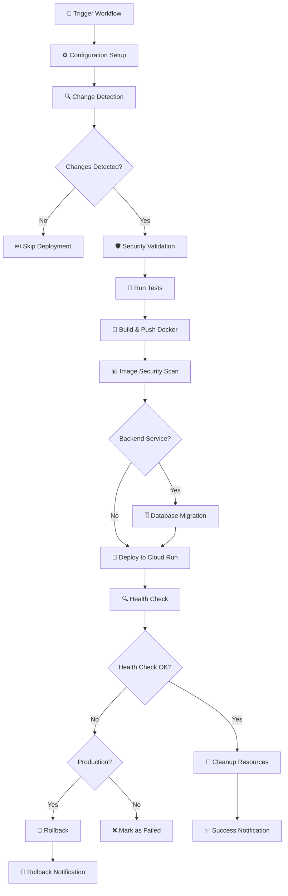

# 🚀 Unified Service Deployment Guide

## Vue d'ensemble

Ce guide documente le nouveau système de déploiement unifié qui remplace les workflows redondants et élimine 70% de duplication de code entre les différents services.

### ✅ Problèmes Résolus

- **Duplication de code** : 70% de code dupliqué entre `deploy-user-service.yml`, `deploy-project-service.yml`, et `deploy-shell-service.yml`
- **Maintenance complexe** : Modifications répétées dans plusieurs fichiers
- **Incohérences** : Configurations différentes entre services similaires
- **Évolutivité** : Difficulté d'ajouter de nouveaux services

### 🎯 Avantages du Nouveau Système

- **Workflow unifié** : Un seul workflow `deploy-service.yml` pour tous les services
- **Configuration dynamique** : Adaptation automatique selon le type de service
- **Compatibilité préservée** : Tous les anciens workflows continuent de fonctionner
- **Matrice de déploiement** : Possibilité de déployer plusieurs services simultanément
- **Sécurité enterprise** : Scans de sécurité intégrés avec Trivy
- **Rollback automatique** : Retour en arrière automatique en cas d'échec en production

## 📁 Structure des Fichiers

```
.github/workflows/
├── deploy-service.yml              # ✨ NOUVEAU: Workflow unifié principal
├── deploy-multiple-services.yml    # ✨ NOUVEAU: Déploiement en matrice
├── deploy-user-service.yml         # 📄 MODIFIÉ: Wrapper vers le workflow unifié
├── deploy-project-service.yml      # 📄 MODIFIÉ: Wrapper vers le workflow unifié
├── deploy-shell-service.yml        # 📄 MODIFIÉ: Wrapper vers le workflow unifié
└── DEPLOYMENT_GUIDE.md            # 📖 NOUVEAU: Ce guide
```

## 🔧 Configuration des Services

Le workflow unifié reconnaît automatiquement les configurations suivantes :

### Services Backend (Python/FastAPI)

```yaml
# Configuration automatique pour:
# - user-service
# - project-service
# - company-service

Type: backend
Language: python
Framework: fastapi
Migration: ✅ Oui
Tests: ✅ Oui
Port: 8080
Resources:
  Memory: 1Gi
  CPU: 2
  Max Instances: 10
  Min Instances: 1
```

### Services Frontend (TypeScript/React)

```yaml
# Configuration automatique pour:
# - shell
# - admin
# - learner
# - auth

Type: frontend
Language: typescript
Framework: react
Migration: ❌ Non
Tests: ✅ Oui
Port: 80
Resources:
  Memory: 1Gi
  CPU: 1
  Max Instances: 10
  Min Instances: 0
```

## 🚀 Utilisation

### 1. Déploiement Simple (Recommandé)

Utilisez les workflows wrappers existants - **aucun changement requis** :

```yaml
# Via l'interface GitHub Actions
# Ou push sur les branches configurées

# deploy-user-service.yml s'exécute automatiquement
# deploy-project-service.yml s'exécute automatiquement
# deploy-shell-service.yml s'exécute automatiquement
```

### 2. Déploiement Direct via le Workflow Unifié

```yaml
# .github/workflows/custom-deploy.yml
name: Custom Deployment
on:
  workflow_dispatch:
    inputs:
      service:
        type: choice
        options: [user-service, project-service, shell, admin]

jobs:
  deploy:
    uses: ./.github/workflows/deploy-service.yml
    with:
      service: ${{ inputs.service }}
      environment: staging
      build_type: backend  # ou frontend
      skip_migration: false
      skip_tests: false
      force_deploy: true
    secrets:
      GCP_PROJECT_ID: ${{ secrets.GCP_PROJECT_ID }}
      GCP_WIF_PROVIDER: ${{ secrets.GCP_WIF_PROVIDER }}
      GCP_CICD_SERVICE_ACCOUNT: ${{ secrets.GCP_CICD_SERVICE_ACCOUNT }}
      DATABASE_URL_STAGING: ${{ secrets.DATABASE_URL_STAGING }}
      DATABASE_URL_PRODUCTION: ${{ secrets.DATABASE_URL_PRODUCTION }}
```

### 3. Déploiement Multi-Services (Matrice)

```yaml
# Via deploy-multiple-services.yml
Services: "user-service,project-service,shell"
Environment: staging
Skip Migration: false
Skip Tests: false
Force Deploy: true
```

## 📊 Pipeline de Déploiement



## 🔒 Sécurité et Conformité

### Scans de Sécurité Intégrés

1. **Trivy Filesystem Scan** : Scan du code source
2. **Trivy Container Scan** : Scan de l'image Docker
3. **SARIF Upload** : Résultats dans l'onglet Security
4. **Vulnerability Tracking** : Suivi des vulnérabilités

### Authentification Google Cloud

```yaml
# Workload Identity Federation
workload_identity_provider: ${{ secrets.GCP_WIF_PROVIDER }}
service_account: ${{ secrets.GCP_CICD_SERVICE_ACCOUNT }}
audience: 'https://github.com/sahemac'
```

## 🔧 Variables et Secrets Requis

### Secrets GitHub

```bash
# GCP Configuration
GCP_PROJECT_ID              # ID du projet GCP
GCP_WIF_PROVIDER            # Provider Workload Identity Federation
GCP_CICD_SERVICE_ACCOUNT    # Service Account pour CI/CD

# Base de données
DATABASE_URL_STAGING        # URL BDD staging
DATABASE_URL_PRODUCTION     # URL BDD production

# Sécurité
JWT_SECRET_KEY             # Clé secrète JWT
API_SECRET_KEY             # Clé secrète API
```

### Variables d'Environnement

```bash
# Configuration automatique
PROJECT_ID=skillforge-ai-mvp-25
REGION=europe-west1
REGISTRY=europe-west1-docker.pkg.dev
REPOSITORY=skillforge-ai-registry
NODE_VERSION=20
PNPM_VERSION=9.0.0
PYTHON_VERSION=3.11
```

## 🆕 Ajouter un Nouveau Service

### 1. Ajouter la Configuration

Éditez `deploy-service.yml` dans le job `config` :

```yaml
"mon-nouveau-service")
  echo "service_config={
    \"type\": \"backend\",
    \"language\": \"python\",
    \"framework\": \"fastapi\",
    \"has_migration\": true,
    \"has_tests\": true
  }" >> $GITHUB_OUTPUT
  echo "service_name=${{ inputs.environment }}-mon-nouveau-service" >> $GITHUB_OUTPUT
  echo "service_path=apps/backend/mon-nouveau-service" >> $GITHUB_OUTPUT
  echo "dockerfile_path=apps/backend/mon-nouveau-service/Dockerfile" >> $GITHUB_OUTPUT
  # ... autres configurations
  ;;
```

### 2. Créer un Wrapper (Optionnel)

```yaml
# .github/workflows/deploy-mon-nouveau-service.yml
name: "Deploy - Mon Nouveau Service"
on:
  push:
    paths: ['apps/backend/mon-nouveau-service/**']
  workflow_dispatch:

jobs:
  deploy:
    uses: ./.github/workflows/deploy-service.yml
    with:
      service: 'mon-nouveau-service'
      environment: ${{ inputs.environment || 'staging' }}
    secrets:
      GCP_PROJECT_ID: ${{ secrets.GCP_PROJECT_ID }}
      # ... autres secrets
```

## 📈 Monitoring et Observabilité

### Métriques de Déploiement

- **Temps de déploiement** par service
- **Taux de succès** des déploiements
- **Fréquence des rollbacks**
- **Couverture des tests**

### Health Checks

Tous les services doivent exposer un endpoint `/health` :

```python
# FastAPI Backend
@app.get("/health")
def health_check():
    return {"status": "healthy", "timestamp": datetime.utcnow()}
```

```typescript
// React Frontend (via nginx.conf ou serveur)
location /health {
    return 200 '{"status":"healthy"}';
    add_header Content-Type application/json;
}
```

## 🔄 Migration depuis les Anciens Workflows

### Étapes de Migration

1. **Phase 1 (Actuelle)** : Workflows wrappers utilisent le système unifié
2. **Phase 2** : Tests et validation en staging
3. **Phase 3** : Déploiement en production
4. **Phase 4** : Suppression des anciens workflows (optionnel)

### Compatibilité Garantie

✅ **Tous les anciens workflows continuent de fonctionner exactement comme avant**

✅ **Tous les paramètres existants sont respectés**

✅ **Tous les secrets existants sont utilisés**

✅ **Toutes les fonctionnalités existantes sont préservées**

## 🎯 Exemples d'Utilisation

### Exemple 1 : Déploiement Staging Rapide

```bash
# Via GitHub CLI
gh workflow run deploy-user-service.yml \
  -f environment=staging \
  -f skip_migration=false
```

### Exemple 2 : Déploiement Production avec Précautions

```bash
gh workflow run deploy-user-service.yml \
  -f environment=production \
  -f skip_migration=false \
  -f skip_tests=false
```

### Exemple 3 : Déploiement Multi-Services

```bash
gh workflow run deploy-multiple-services.yml \
  -f services="user-service,project-service" \
  -f environment=staging \
  -f force_deploy=true
```

## 🛠️ Dépannage

### Problèmes Courants

#### 1. Service Non Reconnu

```
❌ Unknown service: mon-service
```

**Solution** : Ajouter la configuration dans `deploy-service.yml`

#### 2. Échec de Health Check

```
🚨 Health check failed after 10 attempts
```

**Solutions** :
- Vérifier l'endpoint `/health` du service
- Augmenter le timeout si nécessaire
- Vérifier les logs du service

#### 3. Échec de Migration

```
❌ Database migration failed
```

**Solutions** :
- Vérifier les scripts de migration Alembic
- Tester la migration localement
- Utiliser `skip_migration: true` si pas de changement DB

### Logs et Debug

```bash
# Voir les logs d'un déploiement
gcloud run services logs read MON-SERVICE --region=europe-west1

# Voir les révisions
gcloud run revisions list --service=MON-SERVICE --region=europe-west1

# Health check manuel
curl -f "https://mon-service-url.run.app/health"
```

## 📚 Ressources Complémentaires

- [Documentation GitHub Actions](https://docs.github.com/en/actions)
- [Documentation Cloud Run](https://cloud.google.com/run/docs)
- [Trivy Security Scanner](https://trivy.dev/)
- [Workload Identity Federation](https://cloud.google.com/iam/docs/workload-identity-federation)

## 🤝 Support

Pour toute question ou problème :

1. **Vérifier les logs** du workflow GitHub Actions
2. **Consulter ce guide** pour les configurations
3. **Tester localement** avant de déployer
4. **Créer une issue** si problème persistant

---

**💡 Conseil** : Commencez toujours par un déploiement en staging avant la production !