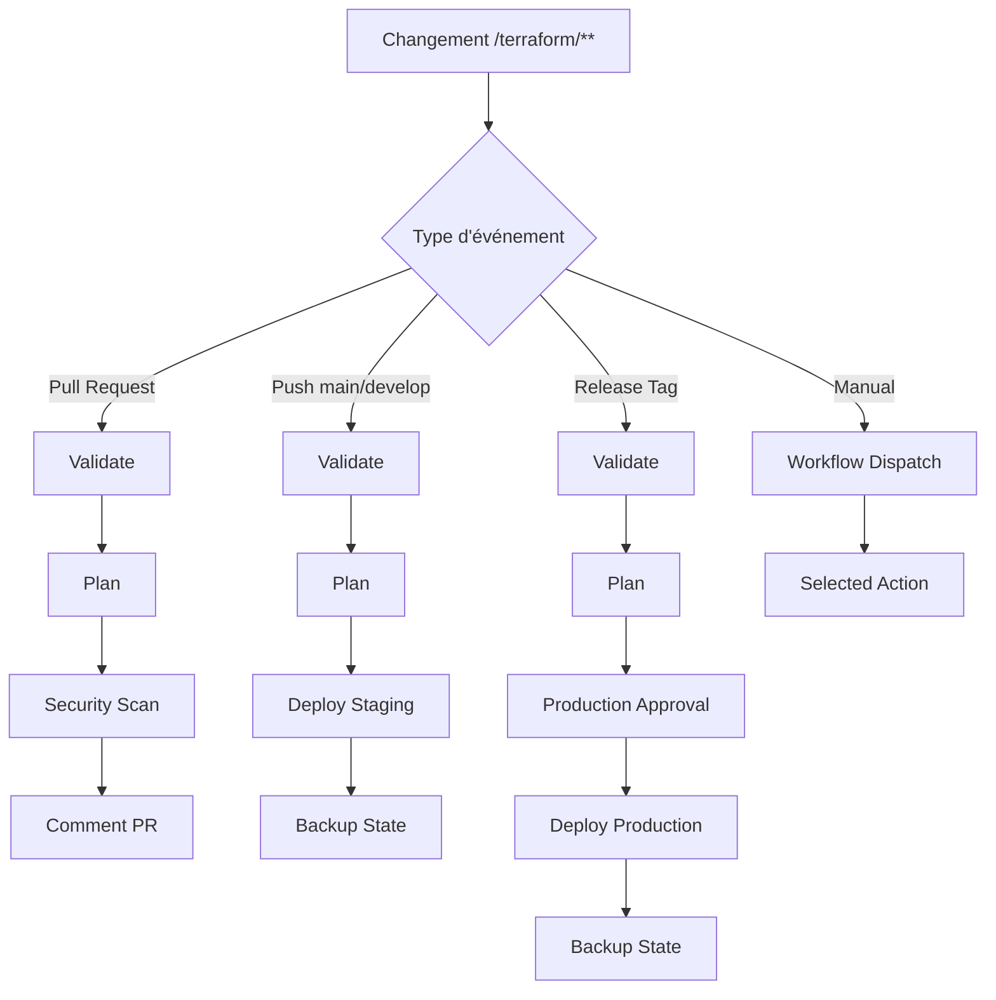

# 🚀 Pipeline Terraform Automatisé - SkillForge AI

## Vue d'ensemble

Ce pipeline automatise complètement la gestion de l'infrastructure SkillForge AI avec Terraform, incluant validation, sécurité, déploiements et rollbacks.

## 🔄 Flux du Pipeline

### 1. Déclencheurs

- **Pull Request** → `/terraform/**` : Validation + Security Scan + Plan
- **Push `develop/main`** → `/terraform/**` : Déploiement automatique en staging
- **Release Tag** : Déploiement en production avec approbation
- **Manual Dispatch** : Déploiement manuel avec choix d'environnement

### 2. Jobs Exécutés



## 🛡️ Sécurité et Validation

### Scans Automatiques

- **Checkov** : Analyse des configurations Terraform
- **TFSec** : Détection des vulnérabilités de sécurité
- **Terraform Validate** : Validation syntaxique
- **Terraform Format** : Vérification du formatage

### Résultats

- Artifacts SARIF uploadés
- Commentaires détaillés sur les PR
- Arrêt du pipeline en cas d'erreurs critiques

## 🏗️ Déploiements

### Staging (Automatique)
- **Déclencheur** : Push sur `develop` ou `main`
- **Approbation** : Aucune
- **Timeout** : 30 minutes
- **Rollback** : Manuel via workflow dispatch

### Production (Contrôlé)
- **Déclencheur** : Release GitHub publié
- **Approbation** : Reviewers requis + 30min wait timer
- **Timeout** : 45 minutes
- **Rollback** : Manuel avec artifacts de backup

## 📦 Artifacts et Backups

### Plans Terraform
- **Nom** : `terraform-plan-{environment}-{sha}`
- **Rétention** : 30 jours
- **Utilisation** : Apply automatique, review manual

### State Backups
- **Staging** : Rétention 90 jours
- **Production** : Rétention 365 jours
- **Format** : JSON avec timestamp

## 🔐 Configuration Requise

### Secrets Repository
```yaml
GCP_WIF_PROVIDER: projects/584748485117/locations/global/workloadIdentityPools/github-actions/providers/github
GCP_CICD_SERVICE_ACCOUNT: terraform-ci-cd@skillforge-ai-mvp-25.iam.gserviceaccount.com
SLACK_WEBHOOK: https://hooks.slack.com/services/...  # Optionnel
TEAMS_WEBHOOK: https://outlook.office.com/webhook/...  # Optionnel
```

### Environment Secrets

**Staging:**
```yaml
TF_VAR_jwt_secret: [64+ caractères]
TF_VAR_postgres_password: [32+ caractères]
```

**Production:**
```yaml
TF_VAR_jwt_secret: [64+ caractères, différent de staging]
TF_VAR_postgres_password: [32+ caractères, différent de staging]
```

## 🔧 Utilisation

### 1. Développement Normal

1. Créer une branche feature
2. Modifier des fichiers dans `/terraform/**`
3. Créer une Pull Request
4. Le pipeline valide automatiquement
5. Review des résultats dans les commentaires PR
6. Merge vers `develop` → déploiement staging automatique

### 2. Déploiement Production

1. Créer une release GitHub depuis `main`
2. Le pipeline plan la production
3. Approbation requise (reviewers + timer)
4. Déploiement automatique après approbation

### 3. Déploiement Manuel

1. Actions → "Terraform Infrastructure Pipeline"
2. "Run workflow"
3. Sélectionner environnement et action
4. Validation des paramètres et exécution

### 4. Rollback d'Urgence

```bash
# 1. Télécharger le backup d'état
gh run download [RUN_ID] -n terraform-state-backup-[env]-[sha]

# 2. Restaurer l'état
cd terraform/environments/[env]
terraform state push backup-state-[sha].json

# 3. Vérifier
terraform plan -var-file="terraform.tfvars"
```

## 📊 Monitoring et Notifications

### Notifications Slack
- ✅ Succès de déploiement
- ❌ Échecs avec détails
- ⚠️ Scans de sécurité avec issues

### GitHub Status Checks
- `terraform/staging` : État du déploiement staging
- `terraform/production` : État du déploiement production
- `terraform/security` : Résultats des scans de sécurité

### Logs et Debugging

```bash
# Voir les runs récents
gh run list --workflow=terraform.yml

# Logs détaillés d'un run
gh run view [RUN_ID] --log

# Télécharger tous les artifacts
gh run download [RUN_ID]
```

## 🚨 Résolution de Problèmes

### Erreur d'Authentification GCP

```yaml
Error: google: could not find default credentials
```

**Solution** :
1. Vérifier `GCP_WIF_PROVIDER` et `GCP_CICD_SERVICE_ACCOUNT`
2. Confirmer que le service account a les bonnes permissions
3. Vérifier que le repository est autorisé dans Workload Identity

### Échec de Plan Terraform

```yaml
Error: Resource already exists
```

**Solution** :
1. Import des ressources existantes : `terraform import`
2. Vérification de l'état : `terraform state list`
3. Refresh forcé : `terraform refresh`

### Timeout de Déploiement

```yaml
Error: deadline exceeded
```

**Solution** :
1. Augmenter le timeout dans le workflow
2. Vérifier les quotas GCP
3. Optimiser les ressources créées en parallèle

### Erreur de Provider Version

```yaml
Error: Resource instance managed by newer provider version
```

**Solution** :
1. Utiliser le script `force-upgrade-provider.ps1`
2. Synchroniser les versions entre environnements
3. Nettoyer le cache : `rm -rf .terraform/`

## 📋 Checklist Pre-Production

Avant chaque release production :

- [ ] Tests staging réussis
- [ ] Scans de sécurité validés
- [ ] Plan production reviewé
- [ ] Backups récents disponibles
- [ ] Monitoring opérationnel
- [ ] Équipe DevOps notifiée
- [ ] Fenêtre de maintenance planifiée

## 🔄 Maintenance

### Mise à jour du Pipeline

1. Modifier `.github/workflows/terraform.yml`
2. Tester sur une branche feature
3. Merge après validation

### Rotation des Secrets

- **Fréquence** : JWT (90j), Passwords (60j)
- **Processus** : Régénération → Update environments → Test
- **Rollback** : Garder anciens secrets 24h

### Nettoyage des Artifacts

```bash
# Script de nettoyage automatique (à inclure dans le workflow)
gh api repos/:owner/:repo/actions/artifacts \
  --jq '.artifacts[] | select(.created_at < "2025-06-01") | .id' \
  | xargs -I {} gh api repos/:owner/:repo/actions/artifacts/{} -X DELETE
```

---

**Dernière mise à jour** : 3 septembre 2025  
**Version Pipeline** : 1.0.0  
**Support** : DevOps Team