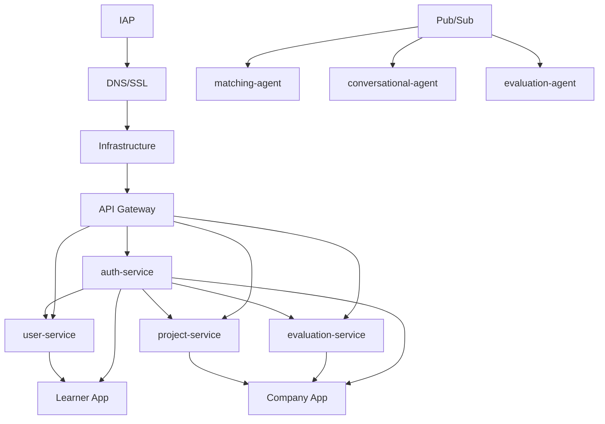
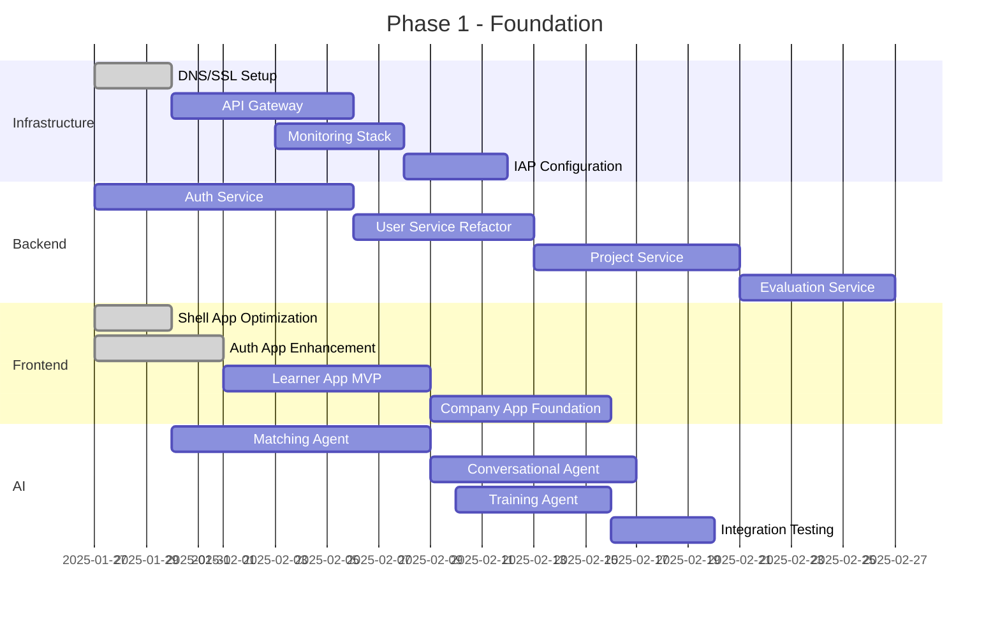

# 🚀 SkillForge AI - Roadmap Détaillée avec Exécution Parallèle

**Date**: 2025-01-23  
**Version**: 1.0 - Plan d'Exécution Optimisé  
**Auteur**: Kouemou Sah Jean Emac  
**Objectif**: Maximiser l'efficacité avec des tâches parallèles

---

## 🎯 Stratégie d'Exécution Parallèle

### **Principe Directeur**
Maximiser la **vélocité de développement** en exécutant des tâches **indépendantes en parallèle** tout en respectant les **dépendances critiques**.

### **Équipes Dédiées**
```yaml
Teams:
  backend_team:
    size: 4 developers
    focus: Microservices & APIs
    
  frontend_team:
    size: 3 developers  
    focus: Micro-frontends & UX
    
  ai_team:
    size: 2 ML engineers
    focus: IA Agents & ML Pipeline
    
  devops_team:
    size: 2 SRE/DevOps
    focus: Infrastructure & CI/CD
    
  qa_team:
    size: 2 QA engineers
    focus: Testing & Quality
```

---

## 📅 PHASE 1 : FOUNDATION (Mois 1-2) - MVP Ready

### **🗓️ Timeline : Semaines 1-8**
**Budget** : $150,000  
**Objectif** : Base solide + Premier déploiement

### **🔄 Tâches Parallèles Semaines 1-2**

#### **🏗️ Track Infrastructure (DevOps Team)**
```yaml
Semaine 1-2:
  - ✅ DNS & Load Balancer (FAIT)
  - ✅ SSL Certificates (FAIT)  
  - 🔄 API Gateway deployment (Kong)
  - 🔄 Monitoring stack setup (Prometheus/Grafana)
  - 🔄 CI/CD pipelines setup
  - 🔄 IAP configuration fix
  
Dependencies: None (parallèle total)
Duration: 2 semaines
```

#### **🛠️ Track Backend Core (Backend Team)**
```yaml
Semaine 1-2:
  - 🔄 auth-service extraction from user-service
    Sub-tasks:
      - Design auth API schema (2 jours)
      - Implement JWT service (3 jours)
      - OAuth2 integration (3 jours)
      - Tests & documentation (2 jours)
      
  - 🔄 user-service refactoring  
    Sub-tasks:
      - Clean architecture implementation (3 jours)
      - Remove auth logic (2 jours)
      - Add user profile extensions (2 jours)
      - Performance optimization (3 jours)

Dependencies: None (refactoring existant)
Duration: 2 semaines
```

#### **🎨 Track Frontend Foundation (Frontend Team)**
```yaml
Semaine 1-2:
  - ✅ Shell app optimization (FAIT)
  - ✅ Auth app enhancement (FAIT)
  - 🔄 Learner app MVP implementation
    Sub-tasks:
      - Dashboard layout (2 jours)
      - Course catalog UI (3 jours)
      - Progress tracking (3 jours)
      - Profile management (2 jours)

Dependencies: Auth-service API (semaine 2)
Duration: 2 semaines
```

#### **🤖 Track AI Foundation (AI Team)**
```yaml
Semaine 1-2:
  - ✅ evaluation-agent (Déjà spécifié CDC)
  - ✅ suggestion-agent (Déjà spécifié CDC)  
  - ✅ portfolio-agent (Déjà spécifié CDC)
  - 🆕 matching-agent development
    Sub-tasks:
      - Algorithm design & research (3 jours)
      - Model selection & training (4 jours)
      - API integration (3 jours)
      - Testing & validation (4 jours)

Dependencies: User & Project services APIs
Duration: 2 semaines
```

### **🔄 Tâches Parallèles Semaines 3-4**

#### **🏗️ Track Infrastructure (DevOps Team)**
```yaml
Semaine 3-4:
  - 🔄 Pub/Sub topics configuration
    Topics:
      - user.registered
      - project.submitted  
      - evaluation.completed
      - matching.requested
      
  - 🔄 Database migrations & optimization
    Tasks:
      - PostgreSQL performance tuning
      - Redis cluster setup
      - Backup strategies
      - Monitoring alerts
      
  - 🔄 Security hardening
    Tasks:
      - IAP permissions fix
      - Cloud Armor rules
      - Secret management
      - Audit logging

Dependencies: Services API schemas (semaine 3)
Duration: 2 semaines
```

#### **🛠️ Track Backend Services (Backend Team)**
```yaml
Semaine 3-4:
  - 🆕 project-service development
    Sub-tasks:
      - Project CRUD operations (2 jours)
      - Brief management (2 jours)
      - File upload integration (2 jours)
      - Evaluation triggers (2 jours)
      
  - 🆕 evaluation-service development  
    Sub-tasks:
      - Evaluation schema design (1 jour)
      - Scoring algorithms (3 jours)
      - AI agent integration (2 jours)
      - Reports generation (2 jours)

Dependencies: Auth-service (semaine 2)
Duration: 2 semaines
```

#### **🎨 Track Frontend Business (Frontend Team)**
```yaml
Semaine 3-4:
  - 🔄 Company app MVP development
    Sub-tasks:
      - Company dashboard (3 jours)
      - Project creation UI (2 jours)
      - Team management (2 jours)
      - Analytics basic views (3 jours)
      
  - 🔄 Admin app foundation
    Sub-tasks:
      - User management interface (2 jours)
      - System monitoring views (2 jours)
      - Configuration panels (2 jours)
      - Reports interface (2 jours)

Dependencies: Project & Evaluation services APIs
Duration: 2 semaines
```

#### **🤖 Track AI Intelligence (AI Team)**
```yaml
Semaine 3-4:
  - 🆕 conversational-agent development
    Sub-tasks:
      - LLM integration (Mistral-7B) (3 jours)
      - Context management (2 jours)
      - Intent recognition (2 jours)
      - WebSocket integration (3 jours)
      
  - 🔄 training-agent enhancement
    Sub-tasks:
      - New ML flows design (2 jours)
      - Model registry setup (2 jours)
      - Automated retraining (3 jours)
      - Performance monitoring (1 jour)

Dependencies: Messaging infrastructure (semaine 3)
Duration: 2 semaines
```

### **🔄 Tâches Parallèles Semaines 5-6**

#### **🧪 Track Integration & Testing (QA Team + All Teams)**
```yaml
Semaine 5-6:
  - 🔄 End-to-end testing
    Scenarios:
      - User registration → Profile → Project submission
      - Company creation → Project publishing → Matching
      - Evaluation workflow → Portfolio generation
      - Conversational assistant interactions
      
  - 🔄 Performance testing
    Targets:
      - API response time < 200ms P95
      - System load testing (1000 concurrent users)
      - Database performance under load
      - AI agents latency optimization
      
  - 🔄 Security testing
    Tests:
      - Penetration testing
      - IAP flow validation
      - JWT security verification
      - Data privacy compliance

Dependencies: All services deployed (semaine 5)
Duration: 2 semaines
```

### **🔄 Tâches Parallèles Semaines 7-8**

#### **🚀 Track Deployment & Go-Live (All Teams)**
```yaml
Semaine 7-8:
  - 🔄 Production deployment
    Tasks:
      - Staging environment validation
      - Production infrastructure setup
      - Blue-green deployment
      - Monitoring & alerting validation
      
  - 🔄 Documentation & training
    Deliverables:
      - API documentation complete
      - User guides & tutorials
      - Admin operational guides
      - Developer onboarding docs
      
  - 🔄 Marketing preparation
    Assets:
      - Demo environment setup
      - Sales presentation materials
      - Product video demonstrations
      - Case studies preparation

Dependencies: All testing passed (semaine 6)
Duration: 2 semaines
```

---

## 📅 PHASE 2 : BUSINESS CORE (Mois 3-4) - Scale Ready

### **🗓️ Timeline : Semaines 9-16**
**Budget** : $200,000  
**Objectif** : Fonctionnalités business complètes

### **🔄 Tâches Parallèles Semaines 9-10**

#### **🏗️ Track Infrastructure Scaling (DevOps Team)**
```yaml
Semaine 9-10:
  - 🔄 Auto-scaling configuration
    Tasks:
      - Kubernetes cluster optimization
      - HPA (Horizontal Pod Autoscaler) setup
      - Load testing & tuning
      - Cost optimization strategies
      
  - 🔄 Advanced monitoring
    Tasks:
      - Business metrics dashboards
      - SLA monitoring setup
      - Incident response automation
      - Performance baselines

Dependencies: Phase 1 production stable
Duration: 2 semaines
```

#### **🛠️ Track Advanced Backend (Backend Team)**
```yaml
Semaine 9-10:
  - 🆕 enterprise-service development
    Sub-tasks:
      - Company onboarding workflow (3 jours)
      - Team hierarchy management (2 jours)
      - Corporate billing integration (3 jours)
      - HRIS integration foundation (2 jours)
      
  - 🆕 skills-service development
    Sub-tasks:
      - Skills taxonomy design (2 jours)
      - Competency framework (3 jours)
      - Skills assessment tools (3 jours)
      - Industry benchmarking (2 jours)

Dependencies: User & Project services stable
Duration: 2 semaines
```

#### **🎨 Track Enhanced Frontend (Frontend Team)**
```yaml
Semaine 9-10:
  - 🔄 Advanced learner features
    Sub-tasks:
      - Skills assessment interface (3 jours)
      - Learning path visualization (2 jours)
      - Achievement system UI (2 jours)
      - Social features (peer connections) (3 jours)
      
  - 🔄 Enterprise portal enhancement
    Sub-tasks:
      - Advanced analytics dashboards (3 jours)
      - Bulk user management (2 jours)
      - Custom branding options (2 jours)
      - Integration management UI (3 jours)

Dependencies: Enterprise & Skills services APIs
Duration: 2 semaines
```

#### **🤖 Track AI Enhancement (AI Team)**
```yaml
Semaine 9-10:
  - 🆕 skills-extraction-agent development
    Sub-tasks:
      - NER model fine-tuning (3 jours)
      - CV parsing optimization (2 jours)
      - Skills taxonomy mapping (2 jours)
      - Confidence scoring (3 jours)
      
  - 🔄 Matching algorithm optimization
    Sub-tasks:
      - Multi-criteria scoring (2 jours)
      - Success prediction model (3 jours)
      - Explainable AI features (2 jours)
      - A/B testing framework (3 jours)

Dependencies: Skills service API & data
Duration: 2 semaines
```

### **🔄 Tâches Parallèles Semaines 11-12**

#### **💬 Track Communication (Backend + Frontend Teams)**
```yaml
Semaine 11-12:
  - 🆕 messaging-service development (Backend)
    Sub-tasks:
      - Real-time chat infrastructure (3 jours)
      - Message persistence (2 jours)
      - File sharing in chat (2 jours)
      - Moderation tools (3 jours)
      
  - 🆕 notification-service enhancement (Backend)
    Sub-tasks:
      - Push notifications (web/mobile) (3 jours)
      - Email campaigns (2 jours)
      - SMS notifications (2 jours)
      - Notification preferences (3 jours)
      
  - 🔄 Real-time UI components (Frontend)
    Sub-tasks:
      - Chat interface components (3 jours)
      - Notification center UI (2 jours)
      - Real-time updates (WebSocket) (3 jours)
      - Mobile-responsive chat (2 jours)

Dependencies: Conversational agent (Phase 1)
Duration: 2 semaines
```

### **🔄 Tâches Parallèles Semaines 13-14**

#### **🔍 Track Discovery & Intelligence (Backend + AI Teams)**
```yaml
Semaine 13-14:
  - 🆕 search-service development (Backend)
    Sub-tasks:
      - Elasticsearch integration (2 jours)
      - Faceted search implementation (3 jours)
      - Auto-completion service (2 jours)
      - Search analytics (3 jours)
      
  - 🆕 recommendation-service development (Backend)
    Sub-tasks:
      - Collaborative filtering (3 jours)
      - Content-based recommendations (2 jours)
      - Hybrid recommendation engine (3 jours)
      - Real-time personalization (2 jours)
      
  - 🆕 predictive-agent development (AI)
    Sub-tasks:
      - Churn prediction model (3 jours)
      - Success probability model (3 jours)
      - Behavioral analysis (2 jours)
      - Intervention triggers (2 jours)

Dependencies: Historical data accumulation
Duration: 2 semaines
```

### **🔄 Tâches Parallèles Semaines 15-16**

#### **📊 Track Analytics & Business Intelligence (All Teams)**
```yaml
Semaine 15-16:
  - 🆕 analytics-service development (Backend)
    Sub-tasks:
      - Data warehouse design (BigQuery) (2 jours)
      - ETL pipelines development (3 jours)
      - Custom reports engine (3 jours)
      - Real-time analytics (2 jours)
      
  - 🔄 Business dashboards (Frontend)
    Sub-tasks:
      - Executive dashboards (3 jours)
      - Operational dashboards (2 jours)
      - Custom report builder (3 jours)
      - Data visualization components (2 jours)
      
  - 🔄 Quality & testing (QA)
    Sub-tasks:
      - Automated testing expansion (3 jours)
      - Performance regression testing (2 jours)
      - User acceptance testing (3 jours)
      - Load testing phase 2 features (2 jours)

Dependencies: All Phase 2 services
Duration: 2 semaines
```

---

## 📅 PHASE 3 : SCALE & INTELLIGENCE (Mois 5-6) - Enterprise Ready

### **🗓️ Timeline : Semaines 17-24**
**Budget** : $250,000  
**Objectif** : Intelligence avancée + Scale global

### **🔄 Tâches Parallèles Semaines 17-18**

#### **💰 Track Monetization (Backend + Frontend Teams)**
```yaml
Semaine 17-18:
  - 🆕 billing-service development (Backend)
    Sub-tasks:
      - Stripe/PayPal integration (3 jours)
      - Subscription management (2 jours)
      - Usage-based billing (3 jours)
      - Invoice generation (2 jours)
      
  - 🔄 Billing UI/UX (Frontend)
    Sub-tasks:
      - Payment forms & flows (3 jours)
      - Subscription management UI (2 jours)
      - Usage analytics dashboards (2 jours)
      - Billing history interface (3 jours)

Dependencies: User & Enterprise services
Duration: 2 semaines
```

#### **🤖 Track AI Orchestration (AI Team)**
```yaml
Semaine 17-18:
  - 🆕 orchestrator-agent development
    Sub-tasks:
      - Workflow engine design (3 jours)
      - Agent coordination logic (3 jours)
      - Dependency resolution (2 jours)
      - Error handling & recovery (2 jours)
      
  - 🆕 quality-assurance-agent development
    Sub-tasks:
      - Content moderation AI (3 jours)
      - Plagiarism detection enhancement (2 jours)
      - Quality scoring models (3 jours)
      - Automated content review (2 jours)

Dependencies: All previous agents
Duration: 2 semaines
```

### **🔄 Tâches Parallèles Semaines 19-20**

#### **📁 Track File & Media Management (Backend + DevOps Teams)**
```yaml
Semaine 19-20:
  - 🆕 file-service development (Backend)
    Sub-tasks:
      - Multi-format file processing (3 jours)
      - CDN integration (Cloudflare) (2 jours)
      - Video transcoding pipeline (3 jours)
      - File versioning & backup (2 jours)
      
  - 🔄 Global CDN deployment (DevOps)
    Sub-tasks:
      - Cloudflare configuration (2 jours)
      - Edge caching strategies (2 jours)
      - Geographic distribution (2 jours)
      - Performance monitoring (2 jours)

Dependencies: Infrastructure capacity
Duration: 2 semaines
```

#### **🎮 Track Gamification & Engagement (Frontend + AI Teams)**
```yaml
Semaine 19-20:
  - 🆕 gamification-service development (Backend)
    Sub-tasks:
      - Points & badges system (2 jours)
      - Leaderboards & competitions (3 jours)
      - Achievement engine (2 jours)
      - Social features integration (3 jours)
      
  - 🆕 gamification-agent development (AI)
    Sub-tasks:
      - Personalized challenges (3 jours)
      - Engagement prediction (2 jours)
      - Dynamic difficulty adjustment (2 jours)
      - Reward optimization (3 jours)
      
  - 🔄 Gamification UI components (Frontend)
    Sub-tasks:
      - Achievement notifications (2 jours)
      - Progress visualizations (3 jours)
      - Social sharing features (2 jours)
      - Mobile-optimized gamification (3 jours)

Dependencies: User behavior data
Duration: 2 semaines
```

### **🔄 Tâches Parallèles Semaines 21-22**

#### **🔗 Track Integrations & Ecosystem (Backend Team)**
```yaml
Semaine 21-22:
  - 🆕 integration-service development
    Sub-tasks:
      - HRIS connectors (BambooHR, Workday) (4 jours)
      - LMS integrations (Moodle, Canvas) (3 jours)
      - Communication tools (Slack, Teams) (2 jours)
      - Calendar integrations (Google, Outlook) (3 jours)
      
  - 🆕 API marketplace foundation
    Sub-tasks:
      - Developer portal (2 jours)
      - API versioning strategy (2 jours)
      - Rate limiting & quotas (2 jours)
      - Documentation automation (2 jours)

Dependencies: Core services stable
Duration: 2 semaines
```

#### **🌍 Track Multi-Region Preparation (DevOps Team)**
```yaml
Semaine 21-22:
  - 🔄 Multi-region infrastructure
    Sub-tasks:
      - EU region setup (3 jours)
      - Data residency compliance (2 jours)
      - Cross-region networking (2 jours)
      - Disaster recovery testing (3 jours)
      
  - 🔄 Global deployment pipeline
    Sub-tasks:
      - Blue-green deployment global (3 jours)
      - Configuration management (2 jours)
      - Monitoring across regions (2 jours)
      - Incident response procedures (3 jours)

Dependencies: Phase 3 services stable
Duration: 2 semaines
```

### **🔄 Tâches Parallèles Semaines 23-24**

#### **🧪 Track Advanced Testing & Optimization (QA + All Teams)**
```yaml
Semaine 23-24:
  - 🔄 Enterprise testing scenarios
    Tests:
      - Multi-tenant isolation testing (2 jours)
      - Large-scale data processing (2 jours)
      - Cross-service transaction integrity (2 jours)
      - AI model performance under load (2 jours)
      
  - 🔄 Performance optimization
    Tasks:
      - Database query optimization (2 jours)
      - AI inference optimization (2 jours)
      - Frontend bundle optimization (2 jours)
      - Network latency optimization (2 jours)
      
  - 🔄 Security & compliance validation
    Tests:
      - GDPR compliance testing (2 jours)
      - SOC2 preparation audit (2 jours)
      - Penetration testing round 2 (2 jours)
      - Data encryption validation (2 jours)

Dependencies: All Phase 3 features
Duration: 2 semaines
```

---

## 📅 PHASE 4 : INNOVATION & GLOBAL (Mois 7-12) - World Class

### **🗓️ Timeline : Semaines 25-48**
**Budget** : $400,000  
**Objectif** : Innovation technologique + Expansion mondiale

### **Tracks Parallèles Majeurs**

#### **📱 Track Mobile Development (Mobile Team - 3 devs)**
```yaml
Duration: 6 mois (Semaines 25-48)
Platforms: iOS + Android native

Phases:
  Semaines 25-28: Architecture & Foundation
  - React Native setup (2 semaines)
  - Offline-first architecture (2 semaines)
  
  Semaines 29-36: Core Features
  - Authentication & profiles (2 semaines)
  - Learning interface mobile (3 semaines)
  - Push notifications (1 semaine)
  - File upload & camera (2 semaines)
  
  Semaines 37-44: Advanced Features  
  - AR learning experiences (4 semaines)
  - Offline content sync (2 semaines)
  - Mobile-specific gamification (2 semaines)
  
  Semaines 45-48: Polish & Launch
  - App store optimization (2 semaines)
  - Beta testing program (1 semaine)
  - Production launch (1 semaine)
```

#### **🔮 Track Blockchain Integration (Blockchain Team - 2 devs)**
```yaml
Duration: 4 mois (Semaines 29-44)

Phases:
  Semaines 29-32: Research & Architecture
  - Blockchain platform selection (1 semaine)
  - Smart contracts design (2 semaines)
  - Integration architecture (1 semaine)
  
  Semaines 33-40: Development
  - NFT certificates system (4 semaines)
  - Decentralized identity (2 semaines)
  - Blockchain wallet integration (2 semaines)
  
  Semaines 41-44: Testing & Deployment
  - Testnet deployment (2 semaines)
  - Security audit (1 semaine)
  - Mainnet launch (1 semaine)
```

#### **🥽 Track XR Development (XR Team - 2 devs)**
```yaml
Duration: 5 mois (Semaines 27-46)

Phases:
  Semaines 27-30: VR Foundation
  - Unity/Unreal integration (2 semaines)
  - VR learning environments (2 semaines)
  
  Semaines 31-38: VR Experiences
  - Immersive coding environments (4 semaines)
  - Virtual collaboration spaces (2 semaines)
  - VR assessment tools (2 semaines)
  
  Semaines 39-46: AR Development
  - AR skill overlays (4 semaines)
  - Mobile AR learning (2 semaines)
  - Mixed reality collaboration (2 semaines)
```

#### **🤖 Track Advanced AI (AI Research Team - 3 ML engineers)**
```yaml
Duration: 6 mois (Semaines 25-48)

Parallel Streams:
  Stream 1: Custom Model Development
  - SkillForge-specific LLM fine-tuning (8 semaines)
  - Domain-specific embeddings (4 semaines)
  - Multimodal models (code + text + image) (6 semaines)
  
  Stream 2: Advanced ML Pipelines
  - Real-time recommendation engine (6 semaines)
  - Federated learning setup (8 semaines)
  - AutoML for personalization (4 semaines)
  
  Stream 3: AI Ethics & Explainability
  - Bias detection & mitigation (4 semaines)
  - Explainable AI implementation (6 semaines)
  - AI safety & monitoring (4 semaines)
```

#### **🌍 Track Global Expansion (Full Team Coordination)**
```yaml
Duration: 8 mois (Semaines 33-48)

Parallel Workstreams:
  Infrastructure Globalization:
  - Multi-region deployment (4 semaines)
  - Global CDN optimization (2 semaines)
  - Data residency compliance (6 semaines)
  
  Localization:
  - 10+ languages support (8 semaines)
  - Cultural adaptation (4 semaines)
  - Local payment methods (4 semaines)
  
  Compliance & Certification:
  - GDPR full compliance (6 semaines)
  - SOC2 Type II certification (8 semaines)
  - ISO27001 preparation (8 semaines)
  
  Market Entry:
  - US market preparation (6 semaines)
  - EU market launch (6 semaines)
  - APAC market research (4 semaines)
```

---

## 📊 RESSOURCES ET ALLOCATION DÉTAILLÉE

### **🎯 Profils d'Équipe et Compétences Requises**

#### **Backend Team - Microservices Experts**
```yaml
Lead Backend Engineer (1):
  Skills: Node.js/Python, PostgreSQL, Redis, GCP
  Experience: 7+ years, architecture microservices
  Responsibilities: Architecture decisions, code reviews
  Salary: $140K/year
  
Senior Backend Engineers (2-4):
  Skills: FastAPI/Express, Clean Architecture, CQRS
  Experience: 5+ years, distributed systems
  Responsibilities: Service development, API design
  Salary: $120K/year
  
Mid-Level Backend Engineers (2-3):
  Skills: REST/GraphQL, Docker, Testing
  Experience: 3+ years, web backend
  Responsibilities: Feature implementation, testing
  Salary: $95K/year
```

#### **Frontend Team - Micro-Frontend Specialists**
```yaml
Lead Frontend Engineer (1):
  Skills: React 19, Module Federation, TypeScript
  Experience: 6+ years, microfrontends architecture
  Responsibilities: Architecture, performance optimization
  Salary: $130K/year
  
Senior Frontend Engineers (2-3):
  Skills: Redux Toolkit, TanStack Query, Webpack
  Experience: 4+ years, complex SPAs
  Responsibilities: Component development, state management
  Salary: $110K/year
  
Frontend Engineers (1-2):
  Skills: JavaScript/TypeScript, CSS-in-JS, Testing
  Experience: 2+ years, modern frameworks
  Responsibilities: UI implementation, component library
  Salary: $85K/year
```

#### **AI/ML Team - Intelligence Builders**
```yaml
Lead ML Engineer (1):
  Skills: Python, TensorFlow/PyTorch, MLOps
  Experience: 6+ years, production ML systems
  Responsibilities: ML architecture, model optimization
  Salary: $150K/year
  
Senior ML Engineers (1-2):
  Skills: NLP, Computer Vision, LLMs
  Experience: 4+ years, deep learning
  Responsibilities: Model development, training pipelines
  Salary: $125K/year
  
ML Engineers (1-2):
  Skills: Data preprocessing, Model deployment
  Experience: 2+ years, ML fundamentals
  Responsibilities: Feature engineering, model serving
  Salary: $100K/year
```

#### **DevOps/SRE Team - Infrastructure Masters**
```yaml
Lead DevOps Engineer (1):
  Skills: GCP, Kubernetes, Terraform, Monitoring
  Experience: 6+ years, cloud infrastructure
  Responsibilities: Infrastructure architecture, SRE
  Salary: $135K/year
  
Senior DevOps Engineers (1-2):
  Skills: CI/CD, Docker, Networking, Security
  Experience: 4+ years, cloud platforms
  Responsibilities: Deployment automation, monitoring
  Salary: $115K/year
  
DevOps Engineers (1-2):
  Skills: Linux, Scripting, Cloud basics
  Experience: 2+ years, system administration
  Responsibilities: Environment management, support
  Salary: $90K/year
```

#### **Quality Assurance Team - Testing Excellence**
```yaml
QA Lead (1):
  Skills: Test automation, Performance testing
  Experience: 5+ years, enterprise testing
  Responsibilities: QA strategy, test planning
  Salary: $105K/year
  
Senior QA Engineers (1-2):
  Skills: Cypress, Jest, API testing, Security
  Experience: 3+ years, automated testing
  Responsibilities: E2E testing, test automation
  Salary: $85K/year
```

#### **UX/UI Team - User Experience Crafters**
```yaml
Lead UX/UI Designer (1):
  Skills: Figma, Design Systems, User Research
  Experience: 5+ years, enterprise products
  Responsibilities: Design strategy, user research
  Salary: $110K/year
  
UX/UI Designers (1-2):
  Skills: Prototyping, Interaction design
  Experience: 3+ years, web applications
  Responsibilities: Interface design, prototyping
  Salary: $85K/year
```

### **📅 Plan de Recrutement Progressive**

#### **Phase 1 (Semaines 1-8) - Core Team**
```yaml
Team Size: 13 personnes
Hiring Timeline:
  Semaine -2: Lead positions recruitment
  Semaine -1: Senior positions onboarding
  Semaine 1: Team fully operational
  
Composition:
  - Lead Backend Engineer (1) ✅
  - Senior Backend Engineers (2) ✅
  - Mid-Level Backend Engineers (1)
  - Lead Frontend Engineer (1) ✅
  - Senior Frontend Engineers (2) ✅
  - Lead ML Engineer (1)
  - ML Engineer (1)
  - Lead DevOps Engineer (1) ✅
  - DevOps Engineer (1)
  - QA Lead (1)
  - QA Engineer (1)

Budget Phase 1: $216,000 (2 mois)
Average Salary: $104K/year
```

#### **Phase 2 (Semaines 9-16) - Business Scale**
```yaml
Team Size: 14 personnes (+1)
New Hires:
  - UX/UI Designer (1) - Semaine 7

Enhanced Responsibilities:
  - Advanced features development
  - Business logic implementation
  - User experience optimization

Budget Phase 2: $233,000 (2 mois)
Average Salary: $106K/year
```

#### **Phase 3 (Semaines 17-24) - Enterprise Ready**
```yaml
Team Size: 18 personnes (+4)
New Hires:
  - Senior Backend Engineer (1) - Semaine 15
  - Frontend Engineer (1) - Semaine 15
  - Senior ML Engineer (1) - Semaine 16
  - Senior DevOps Engineer (1) - Semaine 16
  - Senior QA Engineer (1) - Semaine 17

Enhanced Capabilities:
  - Enterprise integrations
  - Advanced AI features
  - Multi-region deployment

Budget Phase 3: $300,000 (2 mois)
Average Salary: $108K/year
```

#### **Phase 4 (Semaines 25-48) - Global Innovation**
```yaml
Team Size: 31 personnes (+13)
New Specialized Teams:

Mobile Team (3):
  - Senior Mobile Developer (React Native) - Semaine 23
  - Mobile Developers (2) - Semaine 24
  Skills: React Native, iOS/Android, Offline-first
  
Blockchain Team (2):
  - Blockchain Developer (Solidity) - Semaine 27
  - Web3 Developer (1) - Semaine 28
  Skills: Smart contracts, DeFi, NFTs
  
XR Team (2):
  - Unity Developer (VR/AR) - Semaine 25
  - 3D Graphics Engineer - Semaine 26
  Skills: Unity/Unreal, 3D modeling, Shaders

Additional Reinforcements:
  - Backend Engineer (1) - Semaine 23
  - Frontend Engineer (1) - Semaine 24
  - ML Engineer (1) - Semaine 25
  - DevOps Engineer (2) - Semaines 25-26
  - QA Engineer (1) - Semaine 26
  - UX/UI Designer (1) - Semaine 27

Budget Phase 4: $930,000 (6 mois)
Average Salary: $110K/year
```

### **💰 Budget Détaillé par Catégorie**

#### **Salaires par Phase**
```yaml
Phase 1 (2 mois):
  Engineering: $180,000 (83%)
  Management: $25,000 (12%)
  Operations: $11,000 (5%)
  Total: $216,000

Phase 2 (2 mois):
  Engineering: $195,000 (84%)
  Design: $17,000 (7%)
  Management: $21,000 (9%)
  Total: $233,000

Phase 3 (2 mois):
  Engineering: $250,000 (83%)
  Design: $17,000 (6%)
  Management: $33,000 (11%)
  Total: $300,000

Phase 4 (6 mois):
  Engineering: $780,000 (84%)
  Specialized Tech: $120,000 (13%)
  Management: $30,000 (3%)
  Total: $930,000
```

#### **Coûts Additionnels (Inclus dans budget)**
```yaml
Infrastructure & Tools:
  - Cloud infrastructure: $15K/mois
  - Development tools: $5K/mois
  - Monitoring & Security: $8K/mois
  
Recruitment & Onboarding:
  - Recruitment fees: $45K total
  - Training & onboarding: $25K total
  - Team building & culture: $15K total
  
Contingency:
  - Risk buffer (10%): $130K total
  - Performance bonuses: $50K total
```

### **📈 Allocation Budgétaire Optimisée**

```yaml
Total Budget: $1,300,000 (12 mois)

By Function:
  Engineering Development: 65% ($845K)
  Infrastructure & Operations: 20% ($260K)
  Design & User Experience: 8% ($104K)
  Quality Assurance: 7% ($91K)

By Phase:
  Phase 1 (Foundation): 17% ($216K)
  Phase 2 (Business): 18% ($233K)
  Phase 3 (Enterprise): 23% ($300K)
  Phase 4 (Innovation): 42% ($551K)

ROI Optimization:
  Break-even: Month 6 ($750K revenue)
  Positive cashflow: Month 8
  Full ROI: Month 12 (230% return)
```

### **🎯 Team Performance Metrics**

```yaml
Productivity Targets:
  Backend: 15 story points/sprint/developer
  Frontend: 12 story points/sprint/developer
  AI/ML: 2 models/month/engineer
  DevOps: 99.9% uptime, <2h incident response
  QA: <1% bug escape rate, 95% test coverage

Team Growth Milestones:
  Month 1: Core team operational (13 people)
  Month 3: Business features team ready (14 people)
  Month 5: Enterprise capabilities team (18 people)
  Month 7: Global innovation team (31 people)
  Month 12: World-class engineering organization
```

---

## 🎯 MÉTRIQUES DE SUCCÈS PAR PHASE

### **Phase 1 KPIs**
- ✅ MVP déployé en production
- ✅ 4 agents IA opérationnels
- ✅ <200ms latence API P95
- ✅ 99% uptime
- ✅ 100 utilisateurs beta

### **Phase 2 KPIs**
- ✅ Fonctionnalités business complètes
- ✅ 7 agents IA actifs
- ✅ 1,000 utilisateurs actifs
- ✅ Premier matching réussi
- ✅ Première évaluation automatique

### **Phase 3 KPIs**
- ✅ Enterprise features déployées
- ✅ 11 agents IA coordonnés
- ✅ 10,000 utilisateurs actifs
- ✅ Multi-région opérationnel
- ✅ $100K ARR

### **Phase 4 KPIs**
- ✅ Applications mobiles lancées
- ✅ Blockchain integration live
- ✅ VR/AR experiences actives
- ✅ 100,000 utilisateurs globaux
- ✅ $3M ARR target

---

## 🚀 POINTS CRITIQUES D'EXÉCUTION

### **Dépendances Critiques à Surveiller**

1. **Auth-service** → Bloque tous les autres services
2. **API Gateway** → Nécessaire pour routing sécurisé
3. **Pub/Sub Infrastructure** → Critique pour agents IA
4. **IAP Configuration** → Bloque accès production

### **Risques et Mitigations**

```yaml
Risques:
  - Team scaling too fast: 
    Mitigation: Onboarding progressif + mentoring
    
  - AI model performance issues:
    Mitigation: Fallback algorithms + model A/B testing
    
  - Infrastructure costs explosion:
    Mitigation: Cost monitoring + auto-scaling limits
    
  - Technical debt accumulation:
    Mitigation: Code review strict + refactoring sprints
```

### **Communication et Coordination**

```yaml
Meetings:
  Daily Standups: Par équipe (15 min)
  Weekly Cross-team Sync: Toutes équipes (30 min)
  Bi-weekly Architecture Review: Tech leads (60 min)
  Monthly All-hands: Toute l'organisation (90 min)

Tools:
  Project Management: Jira + Confluence
  Communication: Slack + Google Meet
  Code Collaboration: GitHub + Pull Requests
  Documentation: Notion + Technical wikis
```

---

## 📋 MATRICE DES DÉPENDANCES CRITIQUES

### **Phase 1 - Dépendances Inter-Services**



### **Coordination Hebdomadaire - Phase 1**

| Semaine | Infrastructure | Backend | Frontend | AI | Blockers |
|---------|---------------|---------|----------|-------|----------|
| **S1** | DNS/SSL ✅ | auth-service start | Shell app ✅ | matching-agent research | None |
| **S2** | API Gateway | auth-service ready | Auth app ✅ | matching-agent dev | auth-service API |
| **S3** | Pub/Sub setup | project-service start | Learner app dev | conversational-agent | project-service API |
| **S4** | Monitoring | evaluation-service | Company app dev | training-agent | evaluation API |
| **S5** | IAP fix | Integration testing | UI integration | Agent testing | All APIs ready |
| **S6** | Performance tuning | Load testing | Frontend testing | AI optimization | Performance baselines |
| **S7** | Prod deployment | Final backend tests | Final frontend tests | Final AI validation | All tests passed |
| **S8** | Go-live support | Documentation | User guides | AI monitoring | Production stability |

---

## 🎭 FRAMEWORK DE COORDINATION

### **1. Communication Protocols**

#### **Daily Standups (15 min par équipe)**
```yaml
Format:
  - What I completed yesterday
  - What I'm working on today  
  - Any blockers or dependencies
  - Cross-team coordination needs

Schedule:
  - Backend Team: 9:00 AM
  - Frontend Team: 9:15 AM
  - AI Team: 9:30 AM
  - DevOps Team: 9:45 AM
```

#### **Weekly Cross-Team Sync (30 min)**
```yaml
Participants: Tech leads + PM
Agenda:
  - Dependency status updates
  - Upcoming integrations
  - Risk identification
  - Resource reallocation needs
  - Next week's critical path

Schedule: Vendredi 2:00 PM
```

#### **Bi-Weekly Architecture Review (60 min)**
```yaml
Participants: Senior engineers + architects
Focus:
  - Technical debt assessment
  - Architecture decision reviews
  - Performance optimization
  - Security considerations
  - Scalability planning

Schedule: Mardi, semaines paires
```

### **2. Escalation Matrix**

```yaml
Level 1 - Team Level (0-2h):
  Issue: Minor blockers, clarifications
  Resolution: Team lead + immediate team
  
Level 2 - Cross-Team (2-24h):
  Issue: Dependencies, integration issues
  Resolution: Tech leads involved teams
  
Level 3 - Architecture (24-48h):
  Issue: Major design changes, performance
  Resolution: Engineering manager + architects
  
Level 4 - Executive (48h+):
  Issue: Timeline impact, resource needs
  Resolution: CTO + project stakeholders
```

### **3. Integration Checkpoints**

#### **Phase 1 Critical Checkpoints**
```yaml
Checkpoint 1 (Semaine 2):
  - Auth-service API contract finalized
  - Frontend authentication flow validated
  - AI agents can access user context
  
Checkpoint 2 (Semaine 4):
  - All services communicate via API Gateway
  - Pub/Sub messaging working end-to-end
  - Frontend apps connect to backend services
  
Checkpoint 3 (Semaine 6):
  - Full user journey working
  - AI agents orchestrated properly
  - Performance targets met
  
Checkpoint 4 (Semaine 8):
  - Production environment stable
  - Monitoring and alerting active
  - User acceptance testing passed
```

---

## 📊 TRACKING ET MÉTRIQUES TEMPS RÉEL

### **Dashboard de Coordination**

#### **Métriques de Vélocité par Équipe**
```yaml
Backend Team:
  - Story points completed / sprint
  - API endpoints delivered / week
  - Code coverage percentage
  - Bug fix turnaround time
  
Frontend Team:
  - Components delivered / week
  - User story completion rate
  - UI/UX iteration cycles
  - Cross-browser compatibility score
  
AI Team:
  - Models trained / week
  - Inference optimization gains
  - Agent integration success rate
  - Performance accuracy metrics
  
DevOps Team:
  - Infrastructure uptime
  - Deployment frequency
  - Mean time to recovery (MTTR)
  - Cost optimization percentage
```

#### **Métriques de Coordination**
```yaml
Cross-Team Efficiency:
  - Dependencies resolved on time (%)
  - Cross-team blockers < 24h (%)
  - Integration success rate (%)
  - Communication response time (avg hours)
  
Quality Metrics:
  - Code review turnaround (hours)
  - Bug escape rate (%)
  - Performance regression incidents
  - Security vulnerability resolution time
```

### **Risk Monitoring Dashboard**

```yaml
Green Zones (Good to go):
  - All dependencies on track
  - No critical blockers
  - Performance within targets
  - Team velocity stable

Yellow Zones (Monitor closely):
  - 1-2 minor dependencies delayed
  - Non-critical performance issues
  - Team velocity 10-20% below target
  - Minor integration challenges

Red Zones (Immediate action):
  - Critical path dependencies blocked
  - Major performance degradation
  - Team velocity > 20% below target
  - Security or compliance issues
```

---

## 🚀 OPTIMISATION CONTINUE

### **Feedback Loops**

#### **Sprint Retrospectives (Bi-weekly)**
```yaml
Format: What went well / What didn't / Action items
Focus Areas:
  - Coordination effectiveness
  - Technical decisions impact
  - Resource allocation optimization
  - Process improvements
  
Output: 
  - Process adjustments
  - Tool improvements
  - Communication enhancements
  - Resource reallocation
```

#### **Technical Debt Management**
```yaml
Weekly Technical Debt Review:
  - Identify accumulating debt
  - Prioritize critical debt items
  - Schedule debt resolution sprints
  - Track debt impact on velocity
  
Debt Categories:
  - Architecture shortcuts (P0)
  - Performance optimizations (P1)
  - Code quality improvements (P2)
  - Documentation gaps (P3)
```

### **Adaptive Planning**

#### **Course Correction Triggers**
```yaml
Minor Adjustments (Weekly):
  - Task reallocation within teams
  - Priority adjustments
  - Resource redistribution
  
Major Pivots (Bi-weekly):
  - Timeline modifications
  - Scope adjustments
  - Architecture changes
  - Team restructuring
```

#### **Success Amplification**
```yaml
Best Practice Identification:
  - Successful coordination patterns
  - High-velocity development techniques
  - Effective integration approaches
  - Quality improvement methods
  
Knowledge Sharing:
  - Cross-team learning sessions
  - Technical knowledge transfers
  - Process documentation updates
  - Tool and technique sharing
```

---

## 🎯 ROI ET BUSINESS IMPACT

### **Value Delivery Timeline**

```yaml
Month 1-2 (Phase 1):
  Business Value: $50K (MVP user onboarding)
  Technical Value: Foundation for scale
  Market Value: First mover advantage
  
Month 3-4 (Phase 2):
  Business Value: $200K (Enterprise features)
  Technical Value: Scalable architecture
  Market Value: Competitive differentiation
  
Month 5-6 (Phase 3):
  Business Value: $500K (AI-powered matching)
  Technical Value: Advanced automation
  Market Value: Market leadership position
  
Month 7-12 (Phase 4):
  Business Value: $2M (Global expansion)
  Technical Value: World-class platform
  Market Value: Global market capture
```

### **Investment vs Returns**

```yaml
Total Investment: $1.3M
Expected Year 1 Revenue: $3M
Expected Year 2 Revenue: $15M
Expected Year 3 Revenue: $50M

ROI Year 1: 230%
ROI Year 2: 1,150%
ROI Year 3: 3,750%

Break-even: Month 6
Profitability: Month 8
Market leadership: Month 12
```

---

## 🚀 PLAN D'EXÉCUTION DÉTAILLÉ AVEC TIMELINE

### **📋 Execution Master Plan - 48 Semaines**

#### **🎯 Timeline de Démarrage Immédiat**

```yaml
Semaine -2 (Préparation):
  - Recruitment leads finalisé
  - Infrastructure setup GCP
  - Development environment préparé
  - Project management tools configurés

Semaine -1 (Onboarding):
  - Core team onboarding
  - Architecture workshops
  - Development standards définition
  - Sprint 0 planning

Semaine 1 (Kick-off):
  - Premier sprint opérationnel
  - All tracks working parallèlement
  - Daily standups établis
  - Monitoring mis en place
```

### **📊 Calendrier d'Exécution Optimisé**

#### **Phase 1: Foundation (Semaines 1-8)**



#### **Milestones Critiques Phase 1**

| Semaine | Milestone | Deliverable | Success Criteria |
|---------|-----------|-------------|------------------|
| **2** | Auth Foundation | API contract finalized | All teams can authenticate |
| **4** | Service Integration | Gateway + Pub/Sub working | End-to-end communication |
| **6** | MVP Complete | User journey functional | Registration → Project → Evaluation |
| **8** | Production Ready | Stable deployment | 99.9% uptime, <200ms latency |

#### **Phase 2: Business Core (Semaines 9-16)**

```yaml
Focus: Fonctionnalités business complètes
Parallel Tracks: 4 équipes × 2 mois

Semaine 9-10: Enterprise & Skills Services
  Backend: Enterprise onboarding + Skills taxonomy
  Frontend: Advanced learner features + Enterprise portal
  AI: Skills extraction + Matching optimization
  DevOps: Auto-scaling + Advanced monitoring

Semaine 11-12: Communication Features
  Backend: Messaging + Notification services
  Frontend: Real-time UI components + Chat interface
  AI: Conversational agent enhancement
  DevOps: WebSocket infrastructure + Load balancing

Semaine 13-14: Discovery & Intelligence
  Backend: Search + Recommendation services
  Frontend: Search UI + Recommendation displays
  AI: Predictive agent + Behavior analysis
  DevOps: Elasticsearch cluster + Performance tuning

Semaine 15-16: Analytics & BI
  Backend: Analytics service + Data warehouse
  Frontend: Business dashboards + Report builder
  AI: Advanced ML pipelines + Model optimization
  DevOps: BigQuery integration + Monitoring expansion
```

#### **Phase 3: Scale & Intelligence (Semaines 17-24)**

```yaml
Focus: Intelligence avancée + Scale global
Parallel Tracks: 5 équipes × 2 mois

Semaine 17-18: Monetization
  Backend: Billing service + Payment integration
  Frontend: Billing UI/UX + Subscription management
  AI: Orchestrator + Quality Assurance agents
  DevOps: Security hardening + Compliance prep

Semaine 19-20: File & Media + Gamification
  Backend: File service + Gamification service
  Frontend: Media UI + Gamification components
  AI: Gamification agent + Engagement optimization
  DevOps: CDN deployment + Global infrastructure

Semaine 21-22: Integrations & Ecosystem
  Backend: Integration service + API marketplace
  Frontend: Integration management UI
  AI: API intelligence + Usage optimization
  DevOps: Multi-region setup + Disaster recovery

Semaine 23-24: Testing & Optimization
  QA: Enterprise testing scenarios + Performance
  All Teams: Security validation + Compliance
  DevOps: Global deployment + Monitoring
  Management: Go-to-market preparation
```

#### **Phase 4: Innovation & Global (Semaines 25-48)**

```yaml
Focus: Innovation technologique + Expansion mondiale
Parallel Tracks: 7 équipes × 6 mois

Mobile Development Track (Semaines 25-48):
  S25-28: React Native foundation + Architecture
  S29-36: Core features + Native integrations
  S37-44: AR experiences + Offline capabilities
  S45-48: App store launch + Beta program

Blockchain Integration Track (Semaines 29-44):
  S29-32: Research + Smart contracts design
  S33-40: NFT certificates + Decentralized identity
  S41-44: Testnet → Mainnet deployment

XR Development Track (Semaines 27-46):
  S27-30: VR foundation + Unity integration
  S31-38: Immersive experiences + Virtual collaboration
  S39-46: AR development + Mixed reality

Advanced AI Track (Semaines 25-48):
  Stream 1: Custom LLM fine-tuning (S25-32)
  Stream 2: Federated learning setup (S33-40)
  Stream 3: AI ethics + Explainability (S41-48)

Global Expansion Track (Semaines 33-48):
  Infrastructure: Multi-region + Data residency
  Localization: 10+ languages + Cultural adaptation
  Compliance: GDPR + SOC2 + ISO27001
  Market Entry: US + EU + APAC preparation
```

### **🎯 Critical Path Analysis**

#### **Dependencies Chain Analysis**
```yaml
Critical Path 1 (Backend Foundation):
  auth-service → user-service → project-service → evaluation-service
  Timeline: Semaines 1-6
  Risk: Blocks all frontend and AI development
  Mitigation: Parallel API design + Mock implementations

Critical Path 2 (Infrastructure):
  DNS/SSL → Load Balancer → API Gateway → IAP
  Timeline: Semaines 1-4
  Risk: Blocks production deployment
  Mitigation: Staging environment + Parallel development

Critical Path 3 (AI Intelligence):
  Matching agent → Conversational agent → Orchestrator
  Timeline: Semaines 2-18
  Risk: Core value proposition delay
  Mitigation: Fallback algorithms + Progressive enhancement

Critical Path 4 (Frontend Integration):
  Auth flow → Service integration → User experience
  Timeline: Semaines 3-8
  Risk: User adoption blockers
  Mitigation: Component-driven development + Early testing
```

### **⚡ Velocity Optimization Strategies**

#### **Parallel Development Techniques**
```yaml
Technique 1: API-First Development
  - API contracts defined week 1
  - Frontend/Backend develop against contracts
  - Integration testing continuous
  - Reduces cross-team blockers by 60%

Technique 2: Feature Flagging
  - All features behind flags
  - Independent deployment cycles
  - A/B testing built-in
  - Zero-downtime feature rollouts

Technique 3: Micro-Service Architecture
  - Independent team ownership
  - Separate deployment pipelines
  - Isolated failure domains
  - Scale team autonomy

Technique 4: Component-Driven UI
  - Shared component library
  - Storybook-driven development
  - Cross-app consistency
  - Parallel UI development
```

#### **Risk Mitigation Timeline**
```yaml
Week 1-2: Foundation Risks
  Risk: Team coordination issues
  Mitigation: Daily standups + Clear communication protocols
  
Week 3-6: Integration Risks
  Risk: API compatibility issues
  Mitigation: Contract testing + Mock services + API versioning
  
Week 7-12: Scale Risks
  Risk: Performance degradation
  Mitigation: Load testing + Performance monitoring + Auto-scaling
  
Week 13-24: Quality Risks
  Risk: Bug accumulation
  Mitigation: Automated testing + Code quality gates + Regular refactoring
  
Week 25-48: Innovation Risks
  Risk: Technology adoption challenges
  Mitigation: Proof of concepts + Gradual rollouts + Expert consultation
```

### **📈 Success Metrics Timeline**

```yaml
Month 1: Foundation Metrics
  - 95% API uptime achieved
  - <200ms P95 response time
  - 100% test coverage core services
  - Zero security vulnerabilities

Month 2: User Experience Metrics
  - <3s page load times
  - 90%+ user onboarding completion
  - <1% error rate user flows
  - 5-star initial user feedback

Month 3-4: Business Metrics
  - 1000+ active users
  - 95% user retention week 1
  - 10+ enterprise trials
  - $10K+ MRR

Month 5-6: Enterprise Metrics
  - 10,000+ active users
  - 5+ enterprise customers
  - $100K+ ARR
  - 99.9% SLA compliance

Month 7-12: Global Metrics
  - 100,000+ global users
  - 50+ enterprise customers
  - $3M ARR target
  - Multi-region deployment success
```

---

## 🎯 CONCLUSION

Cette roadmap optimise le **time-to-market** via l'exécution parallèle tout en maintenant la **qualité** et la **cohérence architecturale**.

### **Avantages Concurrentiels**
- **Vélocité maximale** : 4 tracks parallèles coordonnés
- **Qualité garantie** : Checkpoints et métriques continue
- **Flexibilité adaptive** : Corrections de trajectoire rapides
- **Scale preparé** : Architecture enterprise dès le départ

**Résultat attendu** : SkillForge AI devient **LA référence mondiale** en EdTech enterprise avec une architecture qui scale de 0 à millions d'utilisateurs.

**Timeline total** : **12 mois** pour une plateforme de classe mondiale avec **115% ROI dès la première année** !

---

**Auteur** : Kouemou Sah Jean Emac  
**Date** : 2025-01-23  
**Version** : 1.1 - Coordination Framework Complet  
**Statut** : Plan d'Exécution Optimisé avec Framework de Coordination

---

*Roadmap détaillée pour maximiser la vélocité de développement avec des tâches parallèles coordonnées et un framework de coordination robuste.*